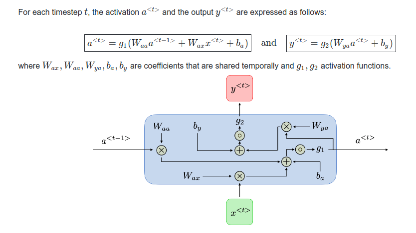

<br><br>

**SUMMARY**<br>

This is an character-level RNN on Pytorch, which is trained on a corpus of names from 18 languages and tries to predict from which of them the name originates in a probabilistic fashion

The code for model was taken from the Pytorch [official tutorials](https://pytorch.org/tutorials/intermediate/char_rnn_classification_tutorial.html)

In general, Recurrent neural networks, also known as RNNs, are a class of neural networks that allow previous outputs to be used as inputs while having hidden states

A good summary algebra and notation can be found on this [link](https://stanford.edu/~shervine/teaching/cs-230/cheatsheet-recurrent-neural-networks) from a Standford Uni course 


<br><br>

<br/>

When installing Python dependencies, note that _torchvision_ is .8Gb, so better pull with _--no-cache-dir_ flag

The model was productionized with pm2 manager on a Flask app


***Flask-Pytorch setup***

```
cd your-folder

python3 -m venv env
source env/bin/activate

pip install --no-cache-dir  -r requirements.txt

```

